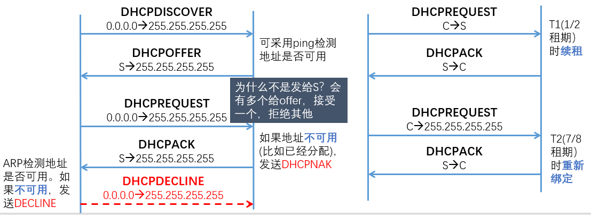
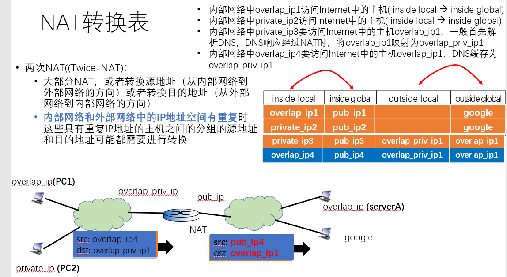

## Computer NetWork Notes
### 目录

- [HTTP的持续连接和非持续连接](#HTTP的持续连接和非持续连接)
  - [非持续连接](#非持续连接方式)
  - [持续连接](#持续连接方式)
- [TCP连接中的ACK和seq](#TCP连接中的ACK和seq)
  - [TCP建立连接](#TCP建立连接)
  - [TCP传输数据](#TCP传输数据)
  - [TCP关闭连接](#TCP关闭连接)
- [TCP快速重传](#TCP快速重传)
- [网络(子网)地址和广播地址计算](#网络地址和广播地址计算)
- [DHCP工作过程](#DHCP工作过程)
- [两次NAT](#两次NAT)
- [LSP 和 LSA](#LSP-和-LSA)

### HTTP的持续连接和非持续连接
#### 非持续连接方式
 HTTP 1.0采用非持续(Non-persistent)连接方式
 新建一个TCP连接需要RTT，然后每次HTTP请求需要1RTT，如果有N个内嵌对象，先请求HTML，再请求N个对象
 响应时间为: (N+1)*2RTT + 传输时间 

 

#### 持续连接方式 
HTTP1.1引入持续(persistent)连接方式 
> 在收到HTTP响应时暂时不关闭TCP连接，而是等待一段时间 

由于不需要每次新建TCP连接，所以需要的时间为RTT + (N+1)RTT = (N+2)RTT

非流水线方式的持续连接： 
  . 发送第一个请求，收到第一个响应 
  . 发送第二个请求，收到第二个响应…. 

流水线方式(pipelining)的持续连接 
  . 发送第一个请求，收到第一个响应(HTML页面) 
  . 发送第2、3、4...个HTTP请求，收到第2、3、4...个HTTP响应 
  . 要求HTTP响应自身能够决定边界（即结束的位置） 
  . Head of line blocking: 按照请求的顺序发送HTTP响应，如果一个对象较大，阻塞后面的对象 
  . 如果中间通过代理服务器，会有实现不兼容的问题 
  . 绝大部分浏览器缺省关闭流水线方式

流水线方式第一个请求2RTT，然后发送所有请求，如果所有响应可以容纳在TCP段中 3RTT + 传输时间

#### get post
application/x-www-form-urlencoded:表单数据
传输表单数据时，
GET请求的数据会附在URL之后（就是把数据放置在HTTP协议头中），以?分割URL和传输数据，参数之间以&相连，如：login.action?name=hyddd&password=idontknow&verify=%E4%BD%A0%E5%A5%BD。如果数据是英文字母/数字，原样发送，如果是空格，转换为+，如果是中文/其他字符，则直接把字符串用BASE64加密，得出如：%E4%BD%A0%E5%A5%BD，其中％XX中的XX为该符号以16进制表示的ASCII。
#### URI URL
> URI = URL+URN

URI，是统一资源标识符，用来唯一的标识一个资源。而URL是统一资源定位器，它是一种具体的URI，即URL可以用来标识一个资源，而且还指明了如何locate这个资源。而URN，统一资源命名，是通过名字来标识资源，比如mailto:java-net@java.sun.com。也就是说，URI是以一种抽象的，高层次概念定义统一资源标识，而URL和URN则是具体的资源标识的方式。URL和URN都是一种URI；

URL一般由三部组成:
①协议(或称为服务方式)
②存有该资源的主机IP地址(有时也包括端口号)
③主机资源的具体地址。如目录和文件名等

URI一般由三部组成:
①访问资源的命名机制
②存放资源的主机名
③资源自身的名称，由路径表示，着重强调于资源。

### TCP连接中的ACK和seq
> TCP通讯中主要有连接的建立、数据的传输、连接的关闭三个过程，每个过程中序列号和确认号的变化是不同的
#### TCP建立连接
即三次握手，它需要三步完成，在TCP的三次握手中，发送第一个SYN的一端执行的是主动打开。而接收这个SYN并发回下一个SYN的另一端执行的是被动打开。
1)  第1步：客户端向服务器发送一个同步数据包请求建立连接，该数据包中，初始序列号（ISN）是客户端随机产生的一个值，确认号是0；

2)  第2步：服务器收到这个同步请求数据包后，会对客户端进行一个同步确认。这个数据包中，序列号（ISN）是服务器随机产生的一个值，确认号是客户端的初始序列号+1；

3)  第3步：客户端收到这个同步确认数据包后，再对服务器进行一个确认。该数据包中，序列号是上一个同步请求数据包中的确认号值，确认号是服务器的初始序列号+1。
##### 注意：因为一个SYN将占用一个序号，所以要加1
|序号|	方向|	seq|	ack|	SYN|	ACK|
|--|--|---|--|--|--|
|1|	A->B|	10000|	0|	1|	0|
|2|	B->A|	20000|	10000+1=10001|	1|	1|
|3|	A->B|	10001|	20000+1=20001|	0|	1|
#### TCP传输数据
在TCP建立连接后，就可以开始传输数据了。TCP工作在全双工模式，它可以同时进行双向数据传输。服务器向客户端发送一个数据包后，客户端收到这个数据包后，会向服务器发送一个确认数据包。
1)  发送数据：服务器向客户端发送一个带有数据的数据包，该数据包中的序列号和确认号与建立连接第三步的数据包中的序列号和确认号相同；

2)  确认收到：客户端收到该数据包，向服务器发送一个确认数据包，该数据包中，序列号是为上一个数据包中的确认号值，而确认号为服务器发送的上一个数据包中的序列号+所该数据包中所带数据的大小。
数据分段中的序列号可以保证所有传输的数据按照正常的次序进行重组，而且通过确认保证数据传输的完整性。
#### TCP关闭连接
建立一个连接需要3个步骤，但是关闭一个连接需要经过4个步骤。因为TCP连接是全双工的工作模式，所以每个方向上需要单独关闭。在TCP关闭连接时，首先关闭的一方（即发送第一个终止数据包的）将执行主动关闭，而另一方（收到这个终止数据包的）再执行被动关闭。
关闭连接的4个步骤如下：

1)  第1步：服务器完成它的数据发送任务后，会主动向客户端发送一个终止数据包，以关闭在这个方向上的TCP连接。该数据包中，序列号为客户端发送的上一个数据包中的确认号值，而确认号为服务器发送的上一个数据包中的序列号+该数据包所带的数据的大小；

2)  第2步：客户端收到服务器发送的终止数据包后，将对服务器发送确认信息，以关闭该方向上的TCP连接。这时的数据包中，序列号为第1步中的确认号值，而确认号为第1步的数据包中的序列号+1；

3)  第3步：同理，客户端完成它的数据发送任务后，就也会向服务器发送一个终止数据包，以关闭在这个方向上的TCP连接，该数据包中，序列号为服务器发送的上一个数据包中的确认号值，而确认号为客户端发送的上一个数据包中的序列号+该数据包所带数据的大小；

4)  第4步：服务器收到客户端发送的终止数据包后，将对客户端发送确认信息，以关闭该方向上的TCP连接。这时在数据包中，序列号为第3步中的确认号值，而确认号为第3步数据包中的序列号+1；

##### 注意：因为FIN和SYN一样，也要占一个序号。理论上服务器在TCP连接关闭时发送的终止数据包中，只有终止位是置1，然后客户端进行确认。但是在实际的TCP实现中，在终止数据包中，确认位和终止位是同时置为1的，确认位置为1表示对最后一次传输的数据进行确认，终止位置为1表示关闭该方向的TCP连接。

### TCP快速重传
#### 1. 为什么丢失报文段之后只能收到重复ACK？
假如发送方发送segment “1234567”，接收方接到的是“1235”，接收方接到5的那一瞬间，知道4有可能丢了，也有可能乱序了，至于是哪种情况，接收方无从知晓。但发送方对于segment 4的状态是完全空白的，既然接收方知道多一点，为什么不把这个信息同步给发送方呢？
通过什么方法把消息同步给发送方呢？

ACK =4

有同学会迷惑不解，明明收到的是5，应该ACK= 6，为何这里是4？

ACK=6 是什么意思？

表示 “12345”都成功接收，问题是4收到了吗？没有啊！所以只能ACK=4。
稍后，接收方所有接收到的segment为 “12356”，接收方如何做？

ACK=4

再稍后，接收方所有接收到的segment为 “123567”，接收方如何做？
ACK =4

#### 2. Reno

当收到三个重复ACK时，快速重传丢失的TCP段，进入快速恢复
- 快速重传，ssthresh=max(cwnd/2, 2*SMSS), cwnd = ssthresh+n*SMSS(n一般为3)
- 由于快速恢复阶段需要 1 RTT，所以中间仍然会收到重复ACK，每收到一个，cwnd+=SMSS
- 当确认新数据的下一个ACK(即丢失报文段及其后各报文段的累加确认)到达时，cwnd=ssthresh，进入拥塞避免阶段

接下来具体分析一下过程，首先拥塞窗口意味着一次可以发送的报文段数量，假设拥塞窗口为cw,那么在收到3个重复ACK之后快速重传丢失的分组，cwnd=cw/2+3;同时继续收到cw-1-3个重复ACK（1个丢失，3个重复），在收到前面cw/2-3时，new_cwnd<=cw/2+3+cw/2-3=cw，因此不会继续发送（因为已经发送了cw个，现在的拥塞窗口不大于cw，所以不会继续发送，以后拥塞窗口增加时会继续发送），在这之后每收到一个重复ACK（还剩下总共cw/2-1），cwnd增加，可以发送新的帧（总共cw/2-1个），new_cwnd = cw/2 + cw -1 。等到快速重传的ACK回来时，退出快速恢复阶段，new_cwnd=cw/2，此时已经发送了cw/2-1，可以在发送一个新的TCP段，进入拥塞避免阶段。

可以看到在前面 RTT/2停止发送（收到cw/2个重复ACK），后面RTT/2时间发送cw/2-1个新增和一个老的帧，即该RTT以cw/2速度发送。 在一个RTT内快速恢复退出。

### 网络地址和广播地址计算

##### 1.子网掩码与IP地址进行位与运算，得网络地址

##### 2.网络地址|(~子网掩码)，得出广播地址            |：位或   ~：按位取反

eg: IP地址10.145.129.20，掩码255.255.248.0，网络地址和广播地址怎么计算？
网络地址 10.145.128.0 广播地址 10.145.135.255

| 地址                             | 二进制                               |
| -------------------------------- | ------------------------------------ |
| IP地址                           | 00001010 10010001 10000001 00010010  |
| 掩码地址                         | 11111111 11111111 11111000 00000000  |
| 子网地址（与）                   | 00001010 10010001 10000001 00000000  |
| 广播地址（掩码为0的部位全换成1） | 00001010 10010001  10000111 11111111 |

对于一个IP地址，分为网络号部分和主机部分，其中申请的IP地址是不包含网络号部分的，所以A类网络126个，B类16384个，C类200多万个，引入子网之后又可以细分为子网号部分和主机部分，子网号部分对应着可以划分多少个子网，而主机部分对应着可以连接的主机数。Internet上的主干路由器维护着相应的路由表。

### DHCP工作过程

其中255.255.255.255是本地广播地址，目标地址为全1的IP分组表示要发送给该链路上所有主机。全0表示那些尚未知道自身IP地址的主机。

所以先向全1发送discover，找到一个DHCP服务器，然后DHCP服务器向全1发送offer（offer包含要分配的IP地址和其他参数），由于可能有多个DHCP服务器收到广播，所有主机可能收到多个offer，所以不能发给s，要继续发给全1广播，这样也告诉其他server拒绝了。

对于续租过程，如果租期过半，就可以直接给server发request，如果成功的话就收到ack，如果没有收到回应，在租期到达7/8时，向全1发送广播，看有没有服务器给出回应。

### 两次NAT

这时候主要是考虑到内部网络和外网中的地址有重复的情况。如内网和公网IP都是overlap_ip，如果PC2使用serverA的域名访问该服务器，但PC2根据DNS服务器解析的结果很可能访问PC1，所以DNS响应经过NAT时，将serverA的overlap_ip映射为overlap_priv_ip。

### LSP 和 LSA

