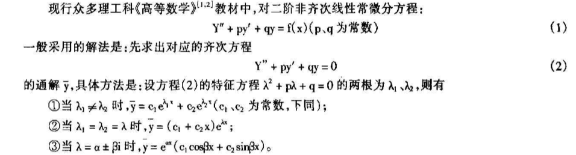

#### 泰勒展开
- [泰勒级数](#泰勒级数)
- [傅里叶级数](#Fourier级数)
- [反三角函数求导](#反三角函数求导)
- [常用公式代码](#常用公式代码)
  - [上/下标](#上/下标)
  - [分式](#分式)
  - [省略号](#省略号)
  - [开根号](#开根号)
  - [矢量](#矢量)
  - [积分](#积分)
  - [极限](#极限)
  - [累加](#累加)
  - [累乘](#累乘)
  - [希腊字母](#希腊字母)
  - [三角函数](#三角函数)
  - [对数函数](#对数函数)
  - [关系运算符](#关系运算符)
  - [其他特殊字符](#其他特殊字符)

##### 泰勒级数

[wiki百科]([https://zh.wikipedia.org/wiki/%E6%B3%B0%E5%8B%92%E7%BA%A7%E6%95%B0](https://zh.wikipedia.org/wiki/泰勒级数))
$$
\frac{1}{1-x}=\sum_{n=1}^{\infty}{x^2}=1+x+x^2+...+x^n+... \quad\forall x:|x|<1
$$

$$
(1+x)^\alpha=\sum_{n=1}^{\infty}
\binom{\alpha}{n}
{x^n}
=1+\alpha x+\frac{\alpha(\alpha-1)}{2 !}x^2+...+\frac{\alpha(\alpha-1)...(\alpha-n+1)}{n !}x^n+... \\ \quad\forall x:|x|<1,\forall\alpha∈ C
$$

$$
e^x=\sum_{n=1}^{\infty}\frac{x^n}{n!}=1+x+\frac{x^2}{2!}+...+\frac{x^n}{n!}+... \quad\forall x
$$

$$
\ln(1-x)=-\sum_{n=1}^{\infty}\frac{x^n}{n}=-x-\frac{x^2}{2}-...-\frac{x^n}{n}-... \quad\forall x∈[-1,1)
$$

$$
\ln(1+x)=\sum_{n=1}^{\infty}\frac{(-1)^{n+1}}{n}x^n=x-\frac{x^2}{2}+\frac{x^3}{3}...+\frac{(-1)^{n+1}}{n}x^n+... \quad\forall x∈(-1,1]
$$

$$
sinx =\sum_{n=1}^{\infty}\frac{(-1)^n}{(2n+1)!}x^{2n+1}=x-\frac{x^3}{3!}+\frac{x^5}{5!}-...
$$

$$
cosx =\sum_{n=1}^{\infty}\frac{(-1)^n}{(2n)!}x^{2n}=1-\frac{x^2}{2!}+\frac{x^4}{4!}-...
$$

##### 反三角函数求导

$$
(arcsinx)'=1/\sqrt{1-x^2} \\
(arccosx)'=-1/\sqrt{1-x^2} \\
(arctanx)'=1/{(1+x^2)} \\
(arccotx)'=-1/{(1+x^2)}
$$

##### Fourier级数

$$
\frac{1}{1^2}+\frac{1}{3^2}+\frac{1}{5^2}+···=\frac{\pi^2}{8} \\
\frac{1}{1^2}+\frac{1}{2^2}+\frac{1}{3^2}+···=\frac{\pi^2}{6} \\
\frac{1}{1^2}-\frac{1}{2^2}+\frac{1}{3^2}+···=\frac{\pi^2}{12} \\
Dirichlet积分:   \int(\frac{sinx}{x})dx=\frac{\pi}{2}
$$



##### 常用公式代码

###### 上/下标

| 算式  | Markdown |
| ----- | -------- |
| $x^2$ | x^2      |
| $y_1$ | y_1      |

###### 分式

| 算式          | Markdown    |
| ------------- | ----------- |
| 1/2           | 1/2         |
| $\frac{1}{2}$ | \frac{1}{2} |

###### 省略号

| 省略号 | Markdown |
| ------ | -------- |
| ...    | \cdots   |

###### 开根号

| 算式       | Markdown |
| ---------- | -------- |
| $\sqrt{2}$ | \sqrt{2} |

###### 矢量

| 算式      | Markdown |
| --------- | -------- |
| $\vec{a}$ | \vec{a}  |

###### 积分

| 算式                | Markdown          |
| ------------------- | ----------------- |
| $\int{x}dx$         | \int{x}dx         |
| $\int_{1}^{2}{x}dx$ | \int_{1}^{2}{x}dx |

###### 极限

| 算式                         | **Markdown**               |
| ---------------------------- | -------------------------- |
| $\lim{a+b}$                  | \lim{a+b}                  |
| $\lim_{n\rightarrow+\infty}$ | \lim_{n\rightarrow+\infty} |

###### 累加

| 算式                    | Markdown              |
| ----------------------- | --------------------- |
| $\sum{a}$               | \sum{a}               |
| $\sum_{n=1}^{100}{a_n}$ | \sum_{n=1}^{100}{a_n} |

###### 累乘

| 算式                    | Markdown              |
| ----------------------- | --------------------- |
| $\prod{x}$              | \prod{x}              |
| $\prod_{n=1}^{99}{x_n}$ | \prod_{n=1}^{99}{x_n} |

###### 希腊字母

[参考代码](https://blog.csdn.net/mingzhuo_126/article/details/82722455)

###### 三角函数

| 三角函数 | Markdown |
| -------- | -------- |
| $sin$    | \sin     |

###### 对数函数

| 算式     | Markdown |
| -------- | -------- |
| $ln2$    | \ln2     |
| $log_28$ | \log_28  |
| $lg10$   | \lg10    |

###### 关系运算符

###### 其它特殊字符

行内公式：“$公式$”

花括号
$$
c(u)=\begin{cases} \sqrt\frac{1}{N}，u=0\\ \sqrt\frac{2}{N}， u\neq0\end{cases}
$$

```
c(u)=\begin{cases} \sqrt\frac{1}{N}，u=0\\ \sqrt\frac{2}{N}， u\neq0\end{cases}  
```

